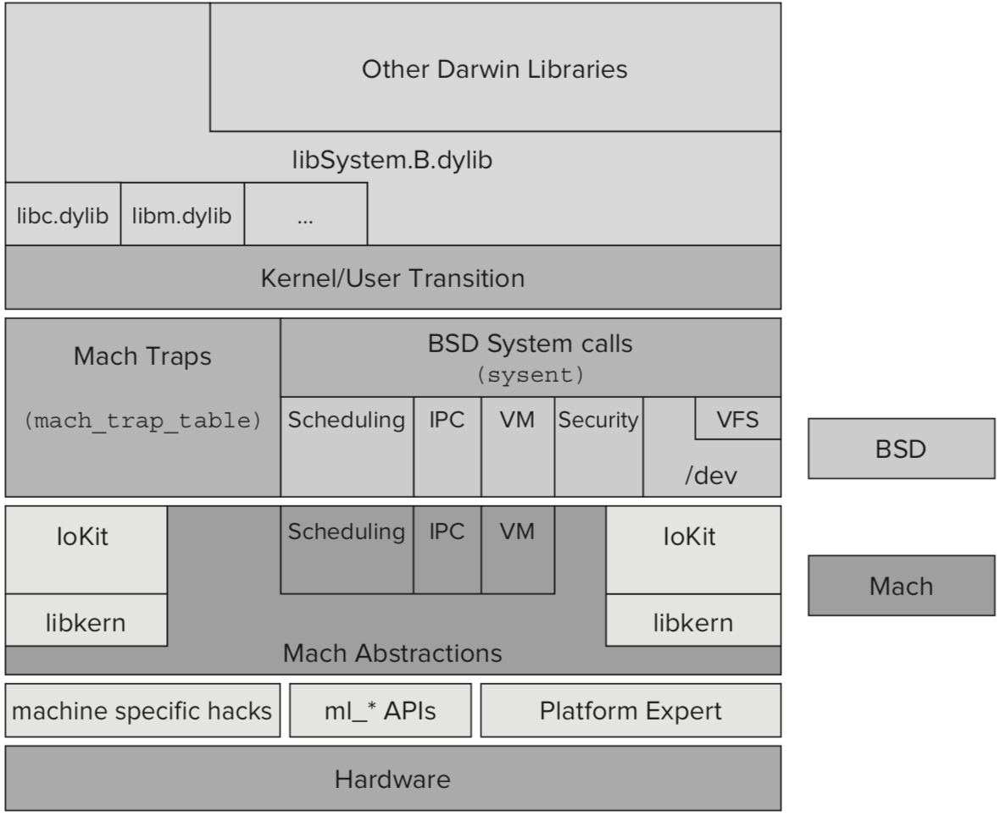

Darwin架构图
===

XNU内核(是一个混合内核，将宏内核与微内核两者的特性兼收并蓄，Darwin操作系统的核心)
===
* Mach(微内核)
  - 进程和线程抽象
  - 虚拟内存管理
  - 任务调度
  - 进程间通信和消息传递机制
* BSD层(宏内核建立在Mach上，提供了更高层次的抽象)
  - UNIX进程模型
  - POSIX线程模型以及相关的同步原语
  - UNIX用户和组
  - 网络协议栈(BSD Socket API)
  - 文件系统访问
  - 设备访问(通过/dev目录访问)
* libKern : 自建,自包含的C++库，用于支持和C++运行时并提所需要的基类
* I/O Kit : 设备驱动程序框架，是苹果引入XNU的重要修改.
